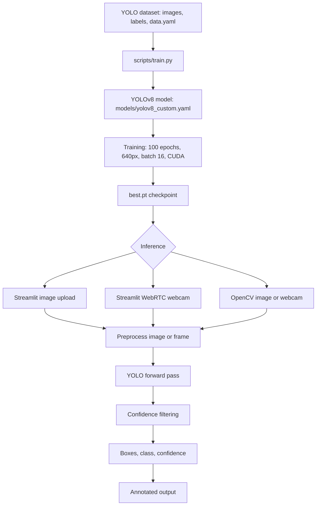

# Object Detection Model Using YOLOv8

A YOLOv8-based vehicle detector for identifying `car`, `emv`, and `htv` in images and live webcam video. The repository includes training, inference, evaluation, visualizations, trained weights, and an interactive Streamlit application.

> **Dataset note:** `datasets/data.yaml` and the dataset image/label directories are referenced by the scripts but are not included in this repository. Provide the dataset or update the paths before training or evaluation.

## End-to-end flow



The model predicts bounding boxes, class IDs, and confidence values. Inference maps IDs to `0=car`, `1=emv`, and `2=htv`, filters detections, draws boxes with OpenCV, and displays the result.

## Repository layout

```text
app.py                         Streamlit image-upload and WebRTC webcam app
scripts/train.py               Training entry point
scripts/test.py                Ultralytics validation entry point
scripts/detect.py              OpenCV image/webcam inference
models/yolov8_custom.yaml      Three-class YOLOv8 architecture
metrics/plots.py               Metric and training-curve generation
plots/plot.py                  Extended evaluation utility
plots/results.csv              Archived per-epoch training history
runs/detect/train/weights/     best.pt and last.pt checkpoints
```

## Environment setup

The declared runtime is Python 3.10. Create an environment and install the dependencies:

```bash
python -m venv .venv
source .venv/bin/activate       # Linux/macOS
# .venv\Scripts\Activate.ps1  # Windows PowerShell
pip install -r requirements.txt
```

## Training

```bash
python scripts/train.py
```

Training outputs are written to `runs/detect/train/`. The `best.pt` checkpoint is selected using validation performance and should be used for inference.

## Inference

### Streamlit application

```bash
streamlit run app.py
```

### OpenCV application

```bash
python scripts/detect.py
```

Choose `1` for webcam detection, `2` for image detection, or `q` to exit.

## Metrics and evaluation

```bash
python scripts/test.py
# or generate the custom plots
python metrics/plots.py
python plots/plot.py
```

The archived experiment reached a best mAP@0.5 of **0.8666** and a best mAP@0.5:0.95 of **0.6480**. These values describe the archived run and are not a guarantee for a retrained model.

## Training and evaluation plots

The following plots are generated from the archived run in [`plots/`](plots/):

### Training curves

| Losses | Learning rates |
|---|---|
|  |  |


### Detection metrics

| Precision curve | Recall curve |
|---|---|
|  |  |

| F1 curve | Precision-recall curve |
|---|---|
|  |  |


### Dataset and prediction examples

| Training batch | Validation labels | Validation predictions |
|---|---|---|
|  |  |  |

Additional training batches and validation examples are available in the [`plots/`](plots/) directory, including `train_batch1.jpg`, `train_batch2.jpg`, `val_batch1_labels.jpg`, and `val_batch1_pred.jpg`.

## Explanation of curves and metrics

This section explains the plots and evaluation metrics shown above. The model detects three classes: `car`, `emv`, and `htv`.

### Training and validation losses

Loss measures the error made by the model; lower values are generally better.

- **Box loss** measures how accurately predicted bounding-box coordinates match the ground-truth boxes. A decreasing value indicates improving localization.
- **Class loss** measures whether detected objects are assigned the correct class. A lower value means better separation of `car`, `emv`, and `htv`.
- **DFL loss** means Distribution Focal Loss. YOLOv8 uses it to improve the precision of bounding-box edges. Lower values generally indicate more precise box boundaries.
- **Training loss** is calculated on images used to update the model weights.
- **Validation loss** is calculated on unseen validation images. Training and validation losses should generally decrease together. If training loss decreases while validation loss increases, the model may be overfitting.

In the archived run, training box loss decreases from about `3.33` to `0.51`, class loss from about `4.17` to `0.32`, and DFL loss from about `4.19` to `1.02` over 100 epochs.

### Learning-rate curves

The `lr/pg0`, `lr/pg1`, and `lr/pg2` lines show learning rates for different optimizer parameter groups in YOLOv8. The learning rate controls the size of weight updates. It commonly decreases during training so that the model makes smaller, more precise updates near the end. These curves describe the optimization process, not detection accuracy.

### Precision

Precision answers: **Of all objects predicted by the model, how many were correct?**

\[
\text{Precision} = \frac{\text{True Positives}}{\text{True Positives} + \text{False Positives}}
\]

High precision means relatively few false detections. A false positive can be a detection where no vehicle exists or a vehicle assigned the wrong class. The archived run reaches approximately `0.88` precision near the end of training. `P_curve.png` shows precision by class in the custom evaluation utility.

### Recall

Recall answers: **Of all real objects in the images, how many did the model find?**

\[
\text{Recall} = \frac{\text{True Positives}}{\text{True Positives} + \text{False Negatives}}
\]

High recall means that the model misses relatively few vehicles. A false negative occurs when a vehicle is not detected, often because it is small, hidden, or below the confidence threshold. The archived run reaches approximately `0.83` recall. `R_curve.png` shows recall by class in the custom evaluation utility.

### F1-score

F1-score combines precision and recall:

\[
F1 = 2 \times \frac{\text{Precision} \times \text{Recall}}{\text{Precision} + \text{Recall}}
\]

F1 is high only when both precision and recall are high. It is useful when false detections and missed vehicles are both important. The standard YOLO F1 curve shows how F1 changes with the confidence threshold; the best point is the threshold with the highest F1. The custom evaluation plot also reports F1 by class.

### Precision-recall curve and PR AUC

The precision-recall (PR) curve plots recall on the horizontal axis and precision on the vertical axis at different confidence thresholds. Increasing the confidence threshold usually reduces false positives and increases precision, but can also increase missed detections and reduce recall.

A curve closer to the upper-right corner is better. **PR AUC** is the area under this curve; a value closer to `1.0` indicates better precision across a range of recall values. The custom evaluation utility calculates PR AUC separately for each class.

### IoU and mAP@0.5

Intersection over Union (IoU) measures overlap between a predicted box and its ground-truth box:

\[
\text{IoU} = \frac{\text{Area of Overlap}}{\text{Area of Union}}
\]

An IoU of `0` means no overlap, `0.5` means 50% overlap under the chosen criterion, and `1.0` means a perfect match.

**mAP@0.5** means mean Average Precision at an IoU threshold of `0.5`. A detection must have the correct class and at least `0.5` IoU with the ground-truth box. Average Precision is calculated from the precision-recall curve for each class and then averaged across classes. The archived run achieved **0.8666** mAP@0.5.

### mAP@0.5:0.95

**mAP@0.5:0.95** calculates Average Precision at IoU thresholds from `0.50` through `0.95` in increments of `0.05`, then averages the results. It is stricter because it evaluates how precisely the predicted boxes fit the objects. The archived run achieved **0.6480** mAP@0.5:0.95. Its lower value compared with mAP@0.5 indicates that detections are generally correct, but box alignment is less consistent at strict IoU thresholds.

### Normalized confusion matrix

The normalized confusion matrix compares true classes with predicted classes. Strong values along the diagonal (`car → car`, `emv → emv`, and `htv → htv`) indicate correct classification. Off-diagonal values show class confusion, such as a ground-truth `car` predicted as `emv`. Because the matrix is normalized, values usually represent proportions within each actual class rather than raw counts.

> **Implementation note:** The custom evaluation scripts currently set `bg_idx = num_classes - 1`. With three classes, this equals the `htv` class index, so background errors can be mixed with `htv` in the custom matrix. For a fully correct background row/column, use `bg_idx = num_classes` and create the matrix with four labels: `car`, `emv`, `htv`, and `background`.

### Training batches, validation labels, and validation predictions

- **Training-batch images** verify that images and training annotations are loaded correctly, boxes align with vehicles, and augmentations preserve the labels.
- **Validation-label images** show the ground-truth annotations used as the expected answers during evaluation.
- **Validation-prediction images** show the model’s predicted boxes, classes, and confidence values. They help identify missed vehicles, false positives, class confusion, and inaccurate box placement.

Visual examples complement the numerical metrics: two models can have similar mAP values while making different practical errors.

## Limitations

- The dataset is not included, so training is not immediately reproducible from a clean clone.
- Several evaluation utilities contain absolute Windows paths; update them before running.
- `scripts/test.py` may reference a stale checkpoint path; use `runs/detect/train/weights/best.pt` when necessary.
- Confidence and IoU/NMS thresholds should be tuned on validation data according to whether false alarms or missed vehicles are more costly.
- The archived metric values apply only to the archived experiment and may differ after retraining.

## License

No license file is included. Add an appropriate license before redistributing the code, model weights, or dataset-derived artifacts.
