# Object Detection Model Using YOLOv8

A YOLOv8-based vehicle detector for identifying `car`, `emv`, and `htv` in images and live webcam video. The repository includes training, inference, evaluation, visualizations, trained weights, and experiment artifacts.

> **Dataset note:** `datasets/data.yaml` and the dataset image/label directories are referenced by the scripts but are not included in this repository. Provide the dataset or update the paths before training and evaluation.

## End-to-end flow

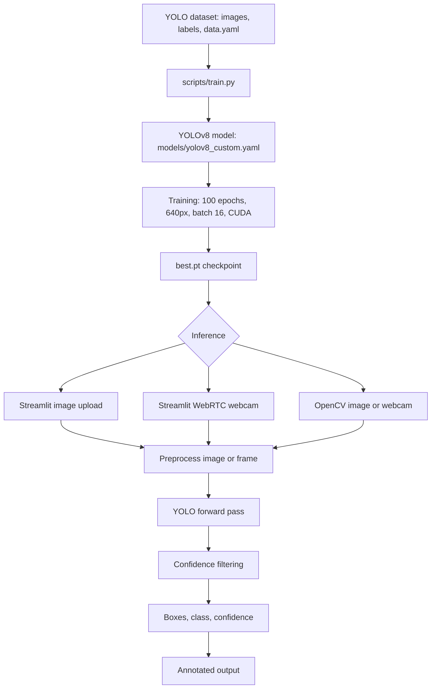

The model predicts bounding boxes, class IDs, and confidence values. Inference maps IDs to `0=car`, `1=emv`, and `2=htv`, filters detections, draws boxes with OpenCV, and displays the result.

## Repository layout

```text
app.py                         Streamlit image-upload and WebRTC webcam app
scripts/train.py               Training entry point
scripts/test.py                Ultralytics validation entry point
scripts/detect.py              OpenCV image/webcam inference
models/yolov8_custom.yaml      Three-class YOLOv8 architecture
metrics/plots.py               Metric and training-curve generation
plots/plot.py                  Extended evaluation utility
plots/results.csv              Archived per-epoch training history
runs/detect/train/weights/     best.pt and last.pt checkpoints
```

## Environment setup

The declared runtime is Python 3.10. Create an environment and install the dependencies:

```bash
python -m venv .venv
source .venv/bin/activate       # Linux/macOS
# .venv\Scripts\Activate.ps1  # Windows PowerShell
pip install -r requirements.txt
```

## Training

```bash
python scripts/train.py
```

Training outputs are written to `runs/detect/train/`. The `best.pt` checkpoint is selected using validation performance and should be used for inference.

## Inference

### Streamlit application

```bash
streamlit run app.py
```

### OpenCV application

```bash
python scripts/detect.py
```

Choose `1` for webcam detection, `2` for image detection, or `q` to exit.

## Metrics and evaluation

```bash
python scripts/test.py
# or generate the custom plots
python metrics/plots.py
python plots/plot.py
```

The archived experiment reached a best mAP@0.5 of **0.8666** and a best mAP@0.5:0.95 of **0.6480**. These values describe the archived run and are not a guarantee for a retrained model.

## Training and evaluation plots

The following plots are generated from the archived run in [`plots/`](plots/):

### Training curves

| Losses | Learning rates |
|---|---|
| 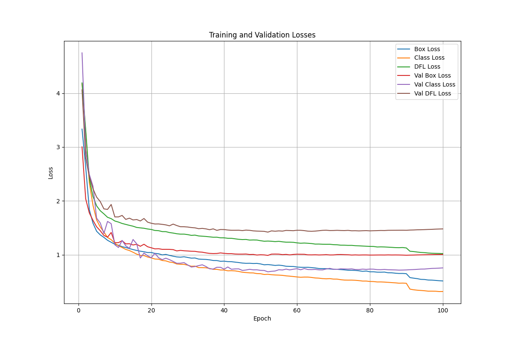 | 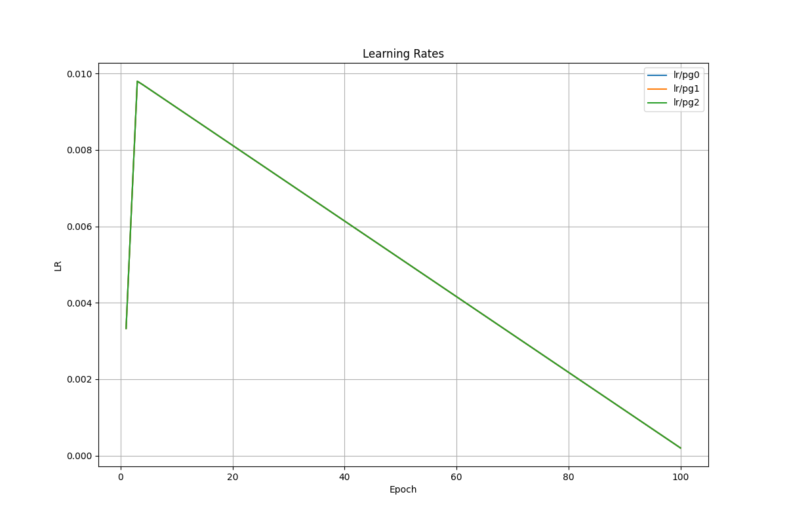 |

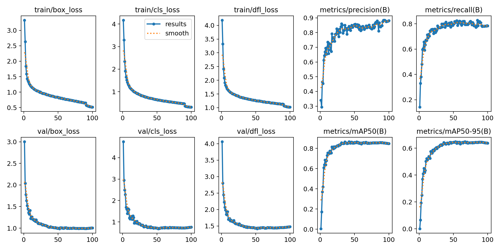

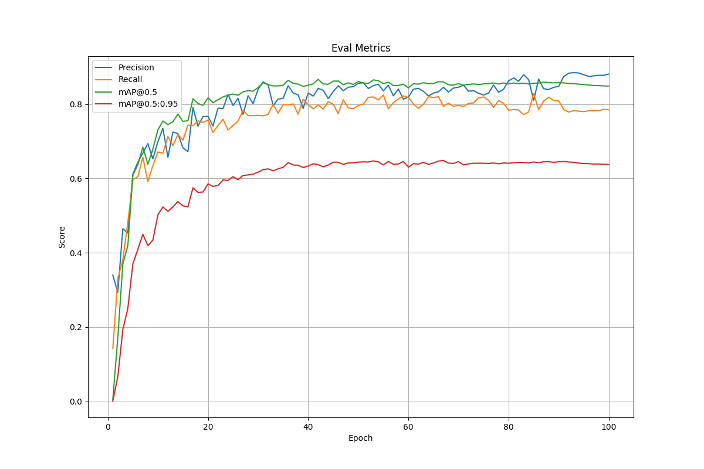

### Detection metrics

| Precision curve | Recall curve |
|---|---|
| 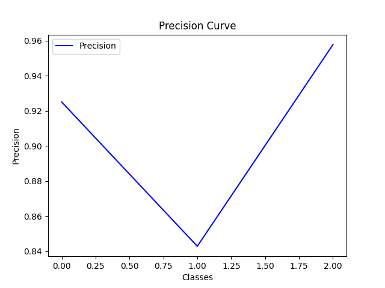 | 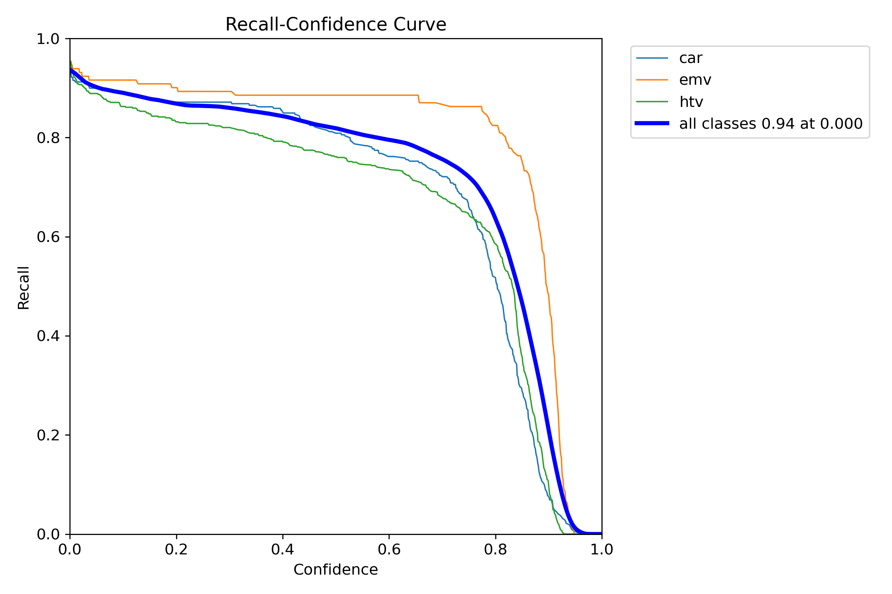 |

| F1 curve | Precision-recall curve |
|---|---|
| 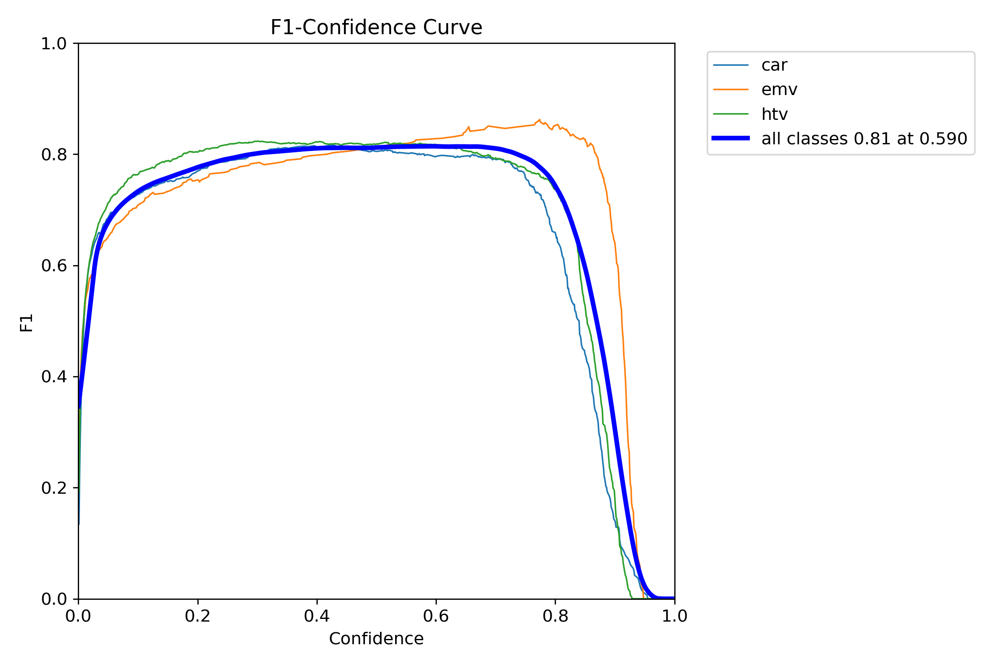 | 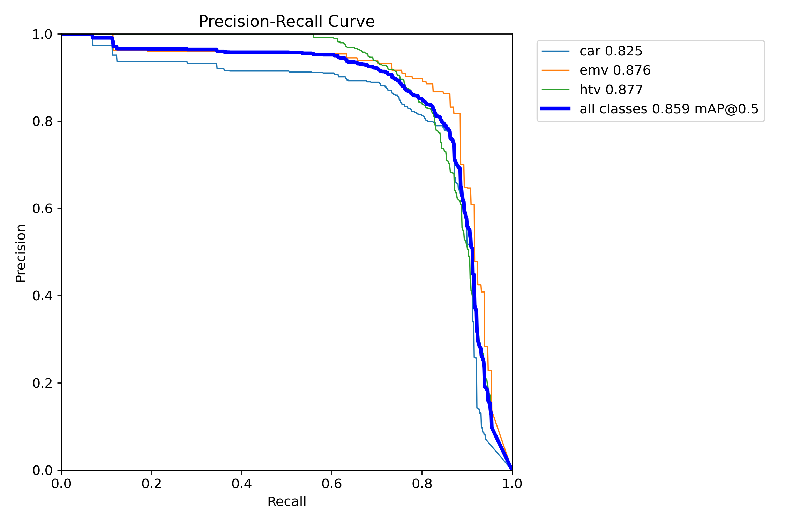 |

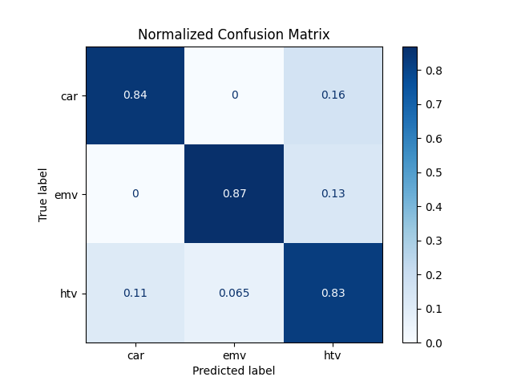

### Dataset and prediction examples

| Training batch | Validation labels | Validation predictions |
|---|---|---|
| 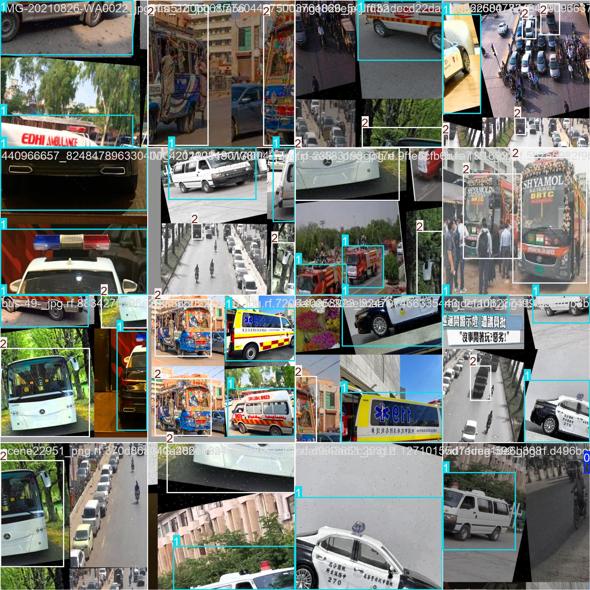 | 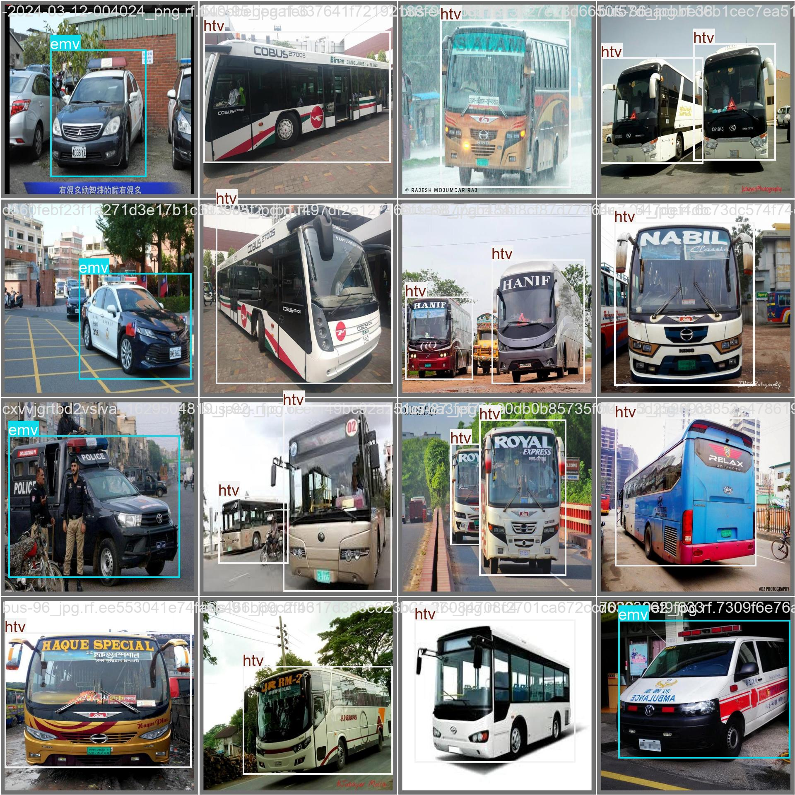 | 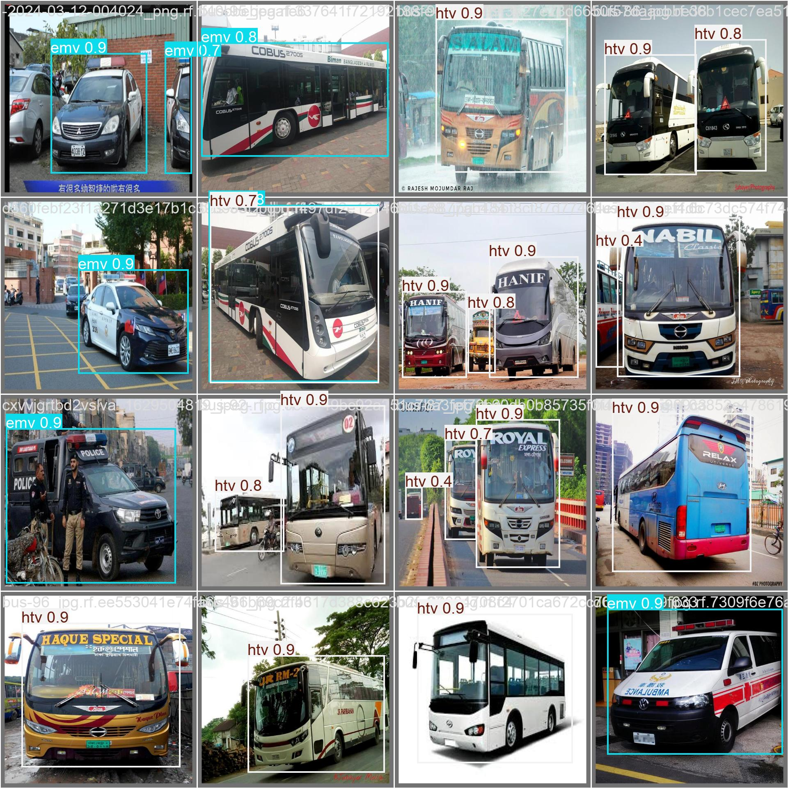 |

Additional training batches and validation examples are available in the [`plots/`](plots/) directory, including `train_batch1.jpg`, `train_batch2.jpg`, `val_batch1_labels.jpg`, `val_batch1_pred.jpg`, `val_batch2_labels.jpg`, and `val_batch2_pred.jpg`.

## Limitations

- The dataset is not included, so training is not immediately reproducible from a clean clone.
- Several evaluation utilities contain absolute Windows paths; update them before running.
- `scripts/test.py` may reference a stale checkpoint path; use `runs/detect/train/weights/best.pt` when necessary.
- Confidence and IoU/NMS thresholds should be tuned on validation data according to whether false alarms or missed vehicles are more costly.

## License

No license file is included. Add an appropriate license before redistributing the code, model weights, or dataset-derived artifacts.
