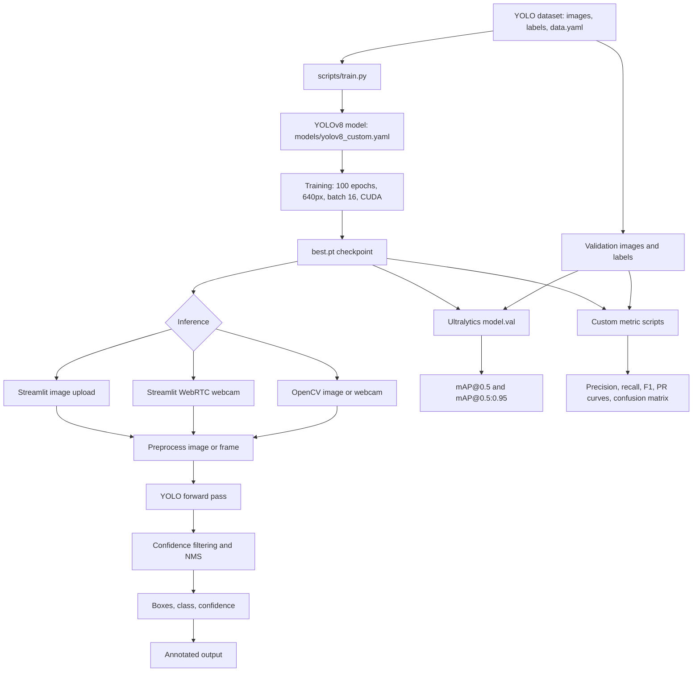
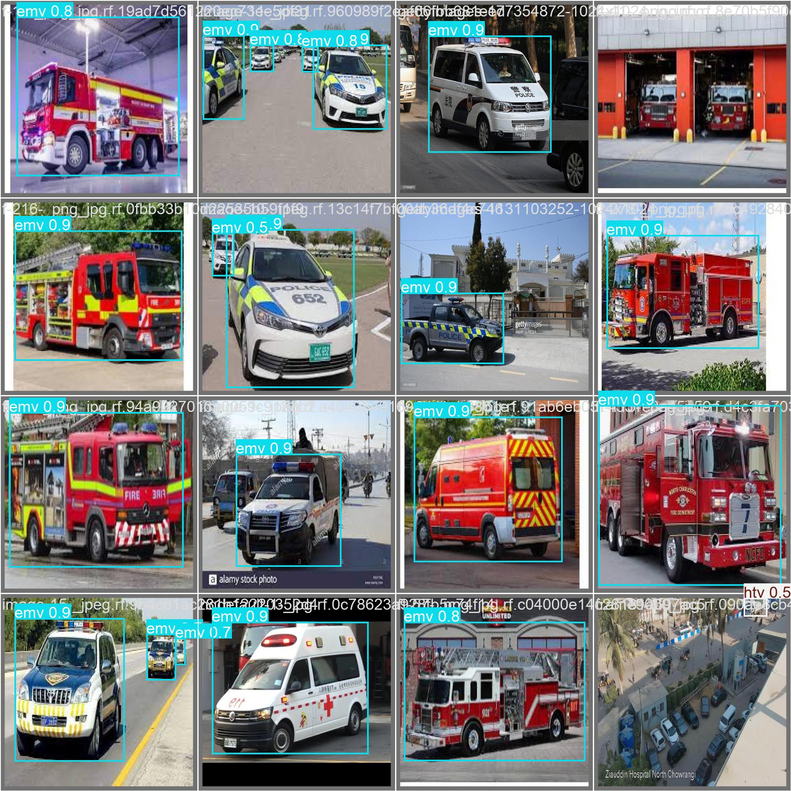
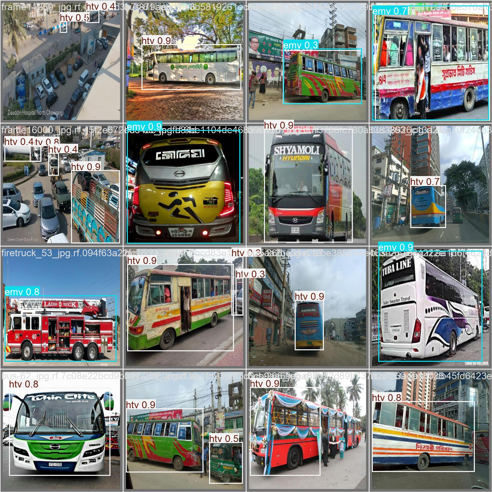

# Object Detection Model Using YOLOv8

A YOLOv8-based vehicle detector for identifying `car`, `emv`, and `htv` in images and live webcam video. The repository includes training, inference, evaluation, visualizations, trained weights, and a Streamlit interface for both upload and webcam workflows.

> **Dataset note:** `datasets/data.yaml` and the dataset image/label directories are referenced by the scripts but are not included in this repository. Provide the dataset or update the paths before training or validation.

## End-to-end flow



The model predicts bounding boxes, class IDs, and confidence values. Inference maps IDs to `0=car`, `1=emv`, and `2=htv`, filters detections, draws boxes with OpenCV, and displays the result.

## How YOLOv8 works

YOLO—**You Only Look Once**—is a single-stage object detector. It processes an image in one neural-network forward pass and directly predicts candidate boxes, class scores, and confidence values.

This project uses a YOLOv8-style architecture with:

1. **Input preprocessing:** images are resized/letterboxed to the configured size while preserving useful spatial proportions.
2. **Backbone:** convolutional and `C2f` blocks extract features at progressively smaller spatial resolutions.
3. **SPPF block:** spatial pyramid pooling gathers context at multiple receptive-field sizes.
4. **Neck:** upsampling and concatenation fuse coarse semantic features with finer spatial features.
5. **Multi-scale heads:** P3, P4, and P5 heads detect vehicles at different sizes, which helps with vehicles that are near or far from the camera.
6. **Prediction decoding:** network outputs are converted into pixel-coordinate boxes, class IDs, and confidence scores.
7. **Post-processing:** confidence filtering and non-maximum suppression remove weak and duplicate detections.

For a detection to be useful, the predicted class must be correct and the predicted box must overlap the vehicle sufficiently. The confidence threshold controls the precision/recall trade-off: raising it reduces false positives but may miss small or distant objects.

## YOLOv8 compared with alternatives

| Detector | Approach | Strengths | Trade-offs compared with YOLOv8 |
|---|---|---|---|
| **YOLOv8** | One-stage, multi-scale detector | Strong speed/accuracy balance, simple Ultralytics API, straightforward deployment | Accuracy depends on data quality and threshold tuning |
| **YOLOv5** | One-stage YOLO detector | Mature ecosystem, fast, widely deployed | Older architecture and tooling |
| **YOLOv7** | One-stage detector | Strong historical real-time performance | Less unified modern training/export workflow |
| **Faster R-CNN** | Two-stage region proposal and classification | Strong localization accuracy | Slower and more computationally expensive for live video |
| **SSD** | One-stage, multi-scale detector | Lightweight and simple | Often weaker accuracy, especially for small or crowded objects |
| **RetinaNet** | One-stage detector with focal loss | Handles class imbalance well | Usually more complex or slower to deploy for this use case |
| **DETR / RT-DETR** | Transformer-based detection | Global context; RT-DETR targets real-time use | Higher architectural complexity and potentially greater training cost |

These are general trade-offs, not universal rankings. A fair benchmark must use the same dataset split, input size, hardware, augmentation policy, confidence/IoU settings, and evaluation procedure.

## Repository layout

```text
app.py                         Streamlit image-upload and WebRTC webcam app
scripts/train.py               Training entry point
scripts/test.py                Ultralytics validation entry point
scripts/detect.py              OpenCV image/webcam inference
models/yolov8_custom.yaml      Three-class YOLOv8 architecture
metrics/plots.py               Metric and training-curve generation
plots/plot.py                  Extended evaluation utility
plots/results.csv              Archived per-epoch training history
runs/detect/train/weights/     best.pt and last.pt checkpoints
metrics/, plots/               Curves, confusion matrices, sample images
wandb/                         Offline experiment-tracking artifacts
requirements.txt              Python dependencies
packages.txt                   Linux system packages
runtime.txt                    Python runtime declaration
```

## Environment setup

The declared runtime is Python 3.10. Create an environment and install the dependencies:

```bash
python -m venv .venv
source .venv/bin/activate       # Linux/macOS
# .venv\Scripts\Activate.ps1  # Windows PowerShell
pip install -r requirements.txt
```

On Linux, install the packages listed in `packages.txt`:

```bash
sudo apt-get update
sudo apt-get install -y libglib2.0-0 libsm6 libxrender1 libxext6
```

Important dependencies include Streamlit, Streamlit-WebRTC, Ultralytics `8.0.134`, PyTorch `2.2.0`, OpenCV, NumPy, and Pillow. Install a CUDA-compatible PyTorch build separately when GPU training is required.

## Dataset format

Create `datasets/data.yaml` in Ultralytics format:

```yaml
path: /absolute/path/to/datasets
train: train/images
val: valid/images
test: test/images
names:
  0: car
  1: emv
  2: htv
```

Each image needs a matching text file in its `labels` directory. Each label line contains normalized YOLO coordinates:

```text
<class_id> <center_x> <center_y> <width> <height>
```

The coordinate values are normalized to `[0, 1]` relative to image width and height. `center_x` and `center_y` identify the box center; `width` and `height` identify its size.

## Training

`scripts/train.py` uses `models/yolov8_custom.yaml` and trains with 100 epochs, 640 × 640 images, batch size 16, CUDA, validation, automatic optimizer selection, and standard augmentations such as mosaic and hue/saturation adjustments.

```bash
python scripts/train.py
```

Outputs are written to `runs/detect/train/`:

- `best.pt`: checkpoint selected using validation performance; use this for inference.
- `last.pt`: checkpoint from the final epoch.
- training history and plots generated by Ultralytics.

The script also exports a TorchScript model. The archived `runs/detect/train/args.yaml` records a previous run using `yolov8s.yaml` and pretrained weights, so a new run may not exactly reproduce the archived results.

## Inference

### Streamlit application

```bash
streamlit run app.py
```

The application loads `runs/detect/train/weights/best.pt`, accepts JPG/JPEG/PNG uploads, and provides a WebRTC webcam tab. It uses a confidence threshold of `0.4` and caches the model with `@st.cache_resource`.

### OpenCV application

```bash
python scripts/detect.py
```

Choose `1` for webcam detection, `2` for image detection, or `q` to exit. On Linux/macOS, change the script's Windows-style checkpoint path to `runs/detect/train/weights/best.pt` if necessary.

### Programmatic inference

```python
from ultralytics import YOLO

model = YOLO("runs/detect/train/weights/best.pt")
results = model("path/to/image.jpg", conf=0.4)

for result in results:
    for box in result.boxes:
        class_id = int(box.cls.item())
        confidence = float(box.conf.item())
        x1, y1, x2, y2 = map(int, box.xyxy[0])
        print(class_id, confidence, (x1, y1, x2, y2))
```

## Metrics and evaluation

`scripts/test.py` calls `model.val(data="datasets/data.yaml")`. The key metrics are:

- **Precision:** `TP / (TP + FP)`, the fraction of predicted objects that are correct.
- **Recall:** `TP / (TP + FN)`, the fraction of ground-truth objects found.
- **IoU:** intersection area divided by union area between a predicted and ground-truth box.
- **AP:** area under a class-specific precision–recall curve as confidence varies.
- **mAP@0.5:** mean AP across classes using IoU ≥ 0.50.
- **mAP@0.5:0.95:** mean AP across IoU thresholds 0.50 through 0.95 in increments of 0.05.
- **F1:** `2 × precision × recall / (precision + recall)`, balancing precision and recall.

A true positive has the correct class and sufficient IoU with an unmatched ground-truth box. Unmatched predictions are false positives; unmatched labels are false negatives.

```bash
python scripts/test.py
```

> `scripts/test.py` may reference `runs\detect\train18\weights\best.pt`, while the committed checkpoint is in `runs/detect/train/weights/best.pt`. Update the path before validation when necessary.

### Archived results

The archived `plots/results.csv` contains 100 epochs:

- Best mAP@0.5: **0.8666** at epoch 42
- Best mAP@0.5:0.95: **0.6480** at epoch 67
- Epoch-100 precision: **0.8807**
- Epoch-100 recall: **0.7845**
- Epoch-100 mAP@0.5: **0.8486**
- Epoch-100 mAP@0.5:0.95: **0.6374**

These values describe the archived experiment and are not a guarantee for a retrained model.

### Custom plots

`metrics/plots.py` and `plots/plot.py` generate loss, learning-rate, precision, recall, F1, PR, and confusion-matrix plots. They use `conf=0.25`, convert normalized YOLO `xywh` labels to pixel `xyxy`, and visualize validation outputs.

Update their hard-coded validation paths before running:

```bash
python metrics/plots.py
# or
python plots/plot.py
```

> **Caveat:** the custom scripts use `bg_idx = num_classes - 1`, which equals `2` and conflicts with the `htv` class. Use Ultralytics validation for formal reporting, or fix the scripts to use background indexing correctly.

## Explanation of curves and metrics

### Training and validation losses

Lower loss generally indicates that the model is making fewer training errors.

- **Box loss** measures how accurately predicted box coordinates match ground-truth boxes.
- **Class loss** measures whether detected objects are assigned the correct class.
- **DFL loss** means Distribution Focal Loss. YOLOv8 uses it to improve the precision of box edges.
- **Training loss** is calculated on images used to update model weights.
- **Validation loss** is calculated on unseen validation images. If training loss decreases while validation loss increases, the model may be overfitting.

In the archived run, training box loss decreases from about `3.33` to `0.51`, class loss from about `4.17` to `0.32`, and DFL loss from about `4.19` to `1.02` over 100 epochs.

### Learning-rate curves

The `lr/pg0`, `lr/pg1`, and `lr/pg2` lines show learning rates for different optimizer parameter groups. The learning rate controls the size of weight updates and commonly decreases during training to stabilize convergence.

### Precision, recall, and F1

Precision answers: **Of all objects predicted by the model, how many were correct?** High precision means relatively few false detections.

Recall answers: **Of all real objects in the images, how many did the model find?** High recall means relatively few missed vehicles.

F1 combines both:

```text
F1 = 2 × (precision × recall) / (precision + recall)
```

F1 is high only when precision and recall are both high. The F1 curve shows how this balance changes as the confidence threshold changes.

### Precision-recall curve and PR AUC

The precision-recall curve plots recall against precision at different confidence thresholds. Raising the confidence threshold usually reduces false positives and increases precision, but can also lower recall because weaker detections are filtered out.

### IoU and mAP

Intersection over Union measures overlap between a predicted box and its ground-truth box:

```text
IoU = area of overlap / area of union
```

An IoU of `0` means no overlap and `1.0` means a perfect overlap. **mAP@0.5** requires the correct class and IoU of at least `0.5`. **mAP@0.5:0.95** averages AP at IoU thresholds from `0.50` through `0.95`, usually in steps of `0.05`.

### Normalized confusion matrix

The normalized confusion matrix compares true classes with predicted classes. Strong diagonal values (`car → car`, `emv → emv`, and `htv → htv`) indicate correct classification. Off-diagonal values show confusion between classes, such as a `car` being predicted as `htv` or vice versa.

> **Implementation note:** with three classes, `bg_idx = num_classes - 1` equals the `htv` class index. Background errors can therefore be mixed with `htv` in the custom matrix. Use `bg_idx = num_classes` or a dedicated background label to avoid ambiguity.

### Training batches and validation examples

- **Training-batch images** verify that images and annotations load correctly and that augmentation preserves the labels.
- **Validation-label images** show the ground-truth annotations used during evaluation.
- **Validation-prediction images** show predicted boxes, classes, and confidence values and help identify missed vehicles, false positives, class confusion, and inaccurate box placement.

## Limitations

- The dataset is not included, so training is not immediately reproducible from a clean clone.
- Several evaluation utilities contain absolute Windows paths; update them before running.
- `scripts/test.py` may reference a stale checkpoint path; use `runs/detect/train/weights/best.pt` when necessary.
- Class names are duplicated across files; a shared configuration or `model.names` would reduce class-order drift.
- Confidence and IoU/NMS thresholds should be tuned on validation data according to whether false alarms or missed vehicles are more costly.
- Archived metric values apply only to the archived experiment and may differ after retraining.

## Generated evaluation plots

The repository already contains the generated training and evaluation charts. These plots are useful for quickly checking whether the model is learning correctly and whether the validation metrics are improving over time.

### Training curves


### Precision and recall curves


### Confusion matrix and validation outputs






## Metric calculation summary

The model is evaluated by comparing predictions to ground-truth bounding boxes and labels.

- **True positive (TP):** a detection matches the right class and has enough overlap with the correct object.
- **False positive (FP):** a prediction is made but it does not match a real object, or the duplicate detection is counted as extra.
- **False negative (FN):** a true object is missed by the detector.

```text
Precision = TP / (TP + FP)
Recall    = TP / (TP + FN)
F1        = 2 × Precision × Recall / (Precision + Recall)
```

The IoU score is calculated as:

```text
IoU = area of overlap / area of union
```

A prediction is counted as a correct match only when the class is correct and the IoU is above the chosen threshold. For example, with `mAP@0.5`, a detection must have IoU ≥ 0.5 and the correct class to count toward the AP score. For `mAP@0.5:0.95`, the model is evaluated at multiple IoU thresholds and the average result is reported.

Average precision (AP) is computed from the precision-recall curve for each class. The mean average precision (mAP) is the average AP across classes, and is what is used as the main detection-quality metric in this project.

## License

No license file is included. Add an appropriate license before redistributing the code, model weights, or dataset-derived artifacts.
