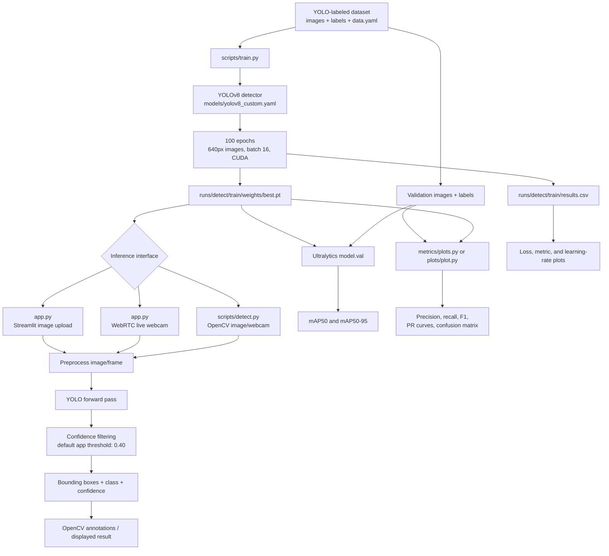

# Object Detection Model Using YOLOv8

A YOLOv8-based vehicle detector for identifying three vehicle categories—`car`, `emv`, and `htv`—in still images and live webcam video. The repository includes training/evaluation scripts, trained weights, generated metric plots, and a Streamlit application for interactive inference.

> **Repository status:** The dataset referenced by the scripts (`datasets/data.yaml` and its image/label directories) is not committed. To retrain or reproduce evaluation, provide a YOLO-format dataset at those paths or update the paths in the scripts.

## End-to-end flow



The model predicts bounding boxes, class IDs, and confidence scores. Inference maps IDs to `['car', 'emv', 'htv']`, filters low-confidence detections, draws boxes with OpenCV, and displays the result.

## Repository layout

```text
app.py                         Streamlit image-upload and WebRTC webcam application
scripts/
  train.py                     YOLO training entry point
  test.py                      Ultralytics validation entry point
  detect.py                    OpenCV command-line image/webcam inference
models/
  yolov8_custom.yaml           Three-class YOLOv8 architecture definition
metrics/
  plots.py                     Metric/training-curve generation utility
  *.png                        Generated evaluation plots
plots/
  plot.py                      Extended evaluation and plotting utility
  results.csv                  Per-epoch Ultralytics training history
  *.png, *.jpg                 Curves, confusion matrices, and sample predictions
runs/detect/train/
  args.yaml                    Arguments recorded for the saved training run
  results.csv                  Training history
  weights/best.pt              Best trained checkpoint used by app.py
  weights/last.pt              Final checkpoint
wandb/                         Offline experiment-tracking artifacts
.devcontainer/                 Codespaces/dev-container configuration
requirements.txt               Python dependencies
packages.txt                   System packages needed by OpenCV/GUI libraries
runtime.txt                    Python runtime declaration
```

## Why YOLOv8 and these design decisions?

- **One-stage detection:** YOLO predicts object locations and classes in one forward pass, making it suitable for near-real-time webcam inference.
- **Multi-scale detection:** `models/yolov8_custom.yaml` has P3, P4, and P5 detection heads for vehicles at different sizes.
- **Three explicit classes:** The model uses `nc: 3`; the application supports `car`, `emv`, and `htv`.
- **640-pixel input:** A practical compromise between localization detail and inference cost.
- **GPU training:** The training entry point uses CUDA, batch size 16, and the recorded run uses mixed precision. Set `device="cpu"` when CUDA is unavailable.
- **Confidence threshold of 0.4 in the app:** This reduces visible false positives. Evaluation uses a separate threshold (`0.25`) to retain more candidates when generating plots.
- **Cached Streamlit model:** `@st.cache_resource` avoids reloading the checkpoint on every Streamlit rerun.
- **Two inference interfaces:** `scripts/detect.py` supports local OpenCV usage; `app.py` supports browser uploads and WebRTC webcam input.

## Environment setup

The project targets Python 3.10 in `runtime.txt`; the dev container uses Python 3.11.

```bash
python -m venv .venv
# Linux/macOS
source .venv/bin/activate
# Windows PowerShell: .venv\Scripts\Activate.ps1
pip install -r requirements.txt
```

On Linux, install the system libraries listed in `packages.txt`:

```bash
sudo apt-get update
sudo apt-get install -y libglib2.0-0 libsm6 libxrender1 libxext6
```

The main dependencies are Streamlit, Streamlit-WebRTC, Ultralytics `8.0.134`, PyTorch `2.2.0`, OpenCV, NumPy, and Pillow. A CUDA-compatible PyTorch installation may be needed separately for GPU training.

## Dataset format

The scripts expect Ultralytics/YOLO detection data. Create `datasets/data.yaml` similar to:

```yaml
path: /absolute/path/to/datasets
train: train/images
val: valid/images
test: test/images
names:
  0: car
  1: emv
  2: htv
```

Each image needs a matching text file in its `labels` directory. Each line uses normalized YOLO coordinates:

```text
<class_id> <center_x> <center_y> <width> <height>
```

Class IDs must agree with the application order: `0=car`, `1=emv`, and `2=htv`.

## How training works

`scripts/train.py` constructs a model from `models/yolov8_custom.yaml` and calls Ultralytics training with 100 epochs, 640 × 640 images, batch size 16, CUDA, validation enabled, `workers=0`, automatic optimizer selection, and YOLO augmentations such as mosaic, horizontal flip, scale, HSV changes, and RandAugment defaults.

```bash
python scripts/train.py
```

The run writes checkpoints and logs under `runs/detect/train/`. `best.pt` is selected by Ultralytics using validation performance; `last.pt` is the final-epoch checkpoint. The script also exports a TorchScript model.

### Reproducibility note

The committed training script uses the custom YAML architecture, while `runs/detect/train/args.yaml` records `model: yolov8s.yaml` and `pretrained: true` for the archived run. Treat the archived metrics as experiment artifacts and do not expect an identical fresh run without the original dataset, version, hardware, and configuration.

## Inference

### Streamlit application

```bash
streamlit run app.py
```

Open the displayed URL, normally `http://localhost:8501`. The **Image Upload** tab accepts JPG, JPEG, and PNG files. The **Live Detection** tab uses the browser webcam after permission is granted. Both paths call the cached model and annotate detections.

The application expects `runs/detect/train/weights/best.pt`. If the checkpoint is moved, update `load_model()` in `app.py`.

### OpenCV command-line workflow

```bash
python scripts/detect.py
```

Choose `1` for webcam detection, `2` for an image path, or `q` to exit. Press `q` in the webcam window or click the OpenCV window to stop live detection. The script currently uses Windows-style checkpoint paths; on Linux/macOS, change it to `runs/detect/train/weights/best.pt`.

### Programmatic inference

```python
from ultralytics import YOLO

model = YOLO("runs/detect/train/weights/best.pt")
results = model("path/to/image.jpg", conf=0.4)

for result in results:
    for box in result.boxes:
        class_id = int(box.cls.item())
        confidence = float(box.conf.item())
        x1, y1, x2, y2 = map(int, box.xyxy[0])
        print(class_id, confidence, (x1, y1, x2, y2))
```

## Evaluation and metrics

### Standard Ultralytics metrics

`scripts/test.py` calls `model.val(data="datasets/data.yaml")` and prints the main detection metrics:

- **Precision:** `TP / (TP + FP)`. The fraction of predicted detections that are correct; high precision means fewer false alarms.
- **Recall:** `TP / (TP + FN)`. The fraction of labeled objects found; high recall means fewer missed vehicles.
- **IoU:** `area(prediction ∩ ground truth) / area(prediction ∪ ground truth)`. Measures bounding-box overlap.
- **AP:** The area under a precision–recall curve for one class as the confidence threshold changes.
- **mAP@0.5:** Mean AP across classes using IoU ≥ 0.50. This is relatively forgiving about localization.
- **mAP@0.5:0.95:** Mean AP across IoU thresholds 0.50, 0.55, ..., 0.95 and classes. This is stricter and rewards tighter boxes.
- **F1 score:** `2 × precision × recall / (precision + recall)`, balancing false positives and false negatives.

A detection is generally a true positive only when its class is correct and its box reaches the required IoU with an unmatched ground-truth box. Duplicate detections and background detections are false positives; missed labels are false negatives.

Run validation with:

```bash
python scripts/test.py
```

> `scripts/test.py` currently references `runs\\detect\\train18\\weights\\best.pt`, while the committed checkpoint is under `runs/detect/train/weights/best.pt`. Update the path before running it, and ensure `datasets/data.yaml` exists.

### Archived results

The archived `plots/results.csv` contains 100 epochs. The recorded run reaches approximately:

- Best mAP@0.5: **0.8666** at epoch 42
- Best mAP@0.5:0.95: **0.6480** at epoch 67
- Epoch-100 precision: **0.8807**
- Epoch-100 recall: **0.7845**
- Epoch-100 mAP@0.5: **0.8486**
- Epoch-100 mAP@0.5:0.95: **0.6374**

These describe the archived run, not a guarantee for a retrained model. The difference between best and final values is why `best.pt` should normally be used instead of `last.pt`.

### Training curves and custom evaluation

`metrics/plots.py` and `plots/plot.py` produce or organize:

- `losses_plot.png`: training and validation box, classification, and distribution-focal losses.
- `metrics_plot.png`: precision, recall, mAP@0.5, and mAP@0.5:0.95 by epoch.
- `learning_rates_plot.png`: learning-rate parameter groups over time.
- `P_curve.png`, `R_curve.png`, and `F1_curve.png`: precision, recall, and F1 curves.
- `PR_curve.png`: precision versus recall; larger area indicates better ranking quality.
- `confusion_matrix_normalized.png`: normalized class outcomes.
- `train_batch*.jpg` and `val_batch*_labels/pred.jpg`: qualitative training and validation checks.

The custom evaluators convert normalized YOLO `xywh` labels to pixel `xyxy` boxes, run inference at `conf=0.25`, sort predictions by confidence, greedily match each prediction to the highest-IoU unmatched ground-truth box, and use IoU ≥ 0.5 for a match. Unmatched predictions become false positives and unmatched labels become false negatives. The scripts then write plots and log mean precision/recall/F1 to TensorBoard under `runs/eval`.

Update the hard-coded validation paths before running either utility:

```bash
python metrics/plots.py
# or
python plots/plot.py
```

> **Evaluation caveat:** both custom plotting scripts set `bg_idx = num_classes - 1`, which is `2` for this three-class model—the same ID as `htv`. They also build confusion-matrix labels using only `range(num_classes)`. Background can therefore be conflated with `htv` or omitted. For formal reporting, use Ultralytics validation or fix the scripts to use a separate background ID (`num_classes`) and include it in the labels.

## Experiment tracking

The `wandb/` directory contains offline Weights & Biases artifacts, including curves, sample images, metadata, and environment requirements. These document experiments locally and are not required to run the Streamlit application.

## Known limitations and improvements

- The dataset and `data.yaml` are not included, so training is not immediately reproducible from a clean clone.
- Several utilities contain absolute Windows paths; replace them with configurable paths or command-line arguments.
- `scripts/test.py` points to `train18`, while the checked-in weights are in `train`.
- Class names are duplicated across files; prefer `model.names` or one shared configuration.
- Correct the custom background handling before using its confusion matrix as a formal report.
- Tune confidence and IoU/NMS thresholds on validation data based on whether missed vehicles or false alarms are more costly.

## License

No license file is currently included. Add an appropriate license before redistributing the code, weights, or dataset-derived artifacts.
